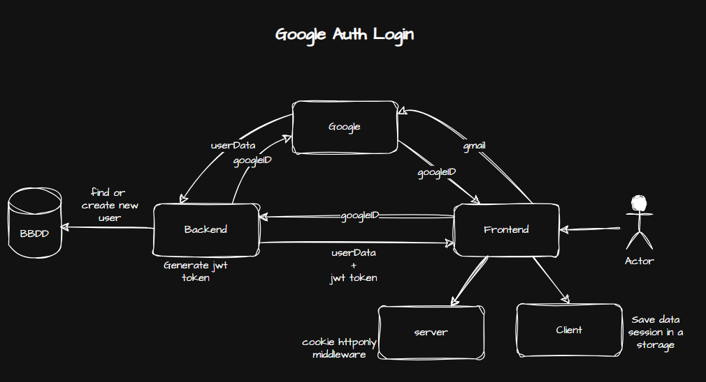
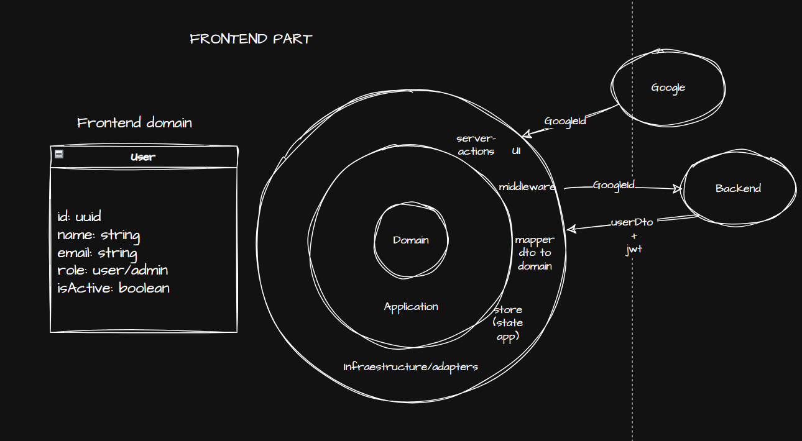

# Google Auth Login

A production-ready **Next.js 16** starter template for Google OAuth authentication. It provides a clean, scalable foundation for building login flows with modern tooling and hexagonal architecture principles.

> **Status:** Template / Boilerplate — the architecture folders are scaffolded but empty. Implement your domain logic, use cases, and infrastructure adapters on top of this base.

---

## Tech Stack

| Layer            | Technology                                     |
| ---------------- | ---------------------------------------------- |
| Framework        | [Next.js](https://nextjs.org/) 16 (App Router) |
| Styling          | [Tailwind CSS](https://tailwindcss.com/) 4     |
| Validation       | [Zod](https://zod.dev/)                        |
| State Management | [Zustand](https://github.com/pmndrs/zustand)   |
| UI Components    | [shadcn/ui](https://ui.shadcn.com/)            |
| Testing          | [Vitest](https://vitest.dev/)                  |
| Language         | TypeScript 5                                   |

---

## Architecture

This project follows **Clean / Hexagonal Architecture** to keep business logic independent from frameworks and external services.

```
src
├── app/
├── domain/          # Entities, value objects, domain errors
├── application/     # Use cases, ports (interfaces)
├── infraestructure/ # Adapters: API clients, external services, dtos, mappers
├── ui/              # Components, hooks
```

### Responsibilities

| Layer              | What lives here                                                                                                                   |
| ------------------ | --------------------------------------------------------------------------------------------------------------------------------- |
| **Domain**         | Core business rules, entities, and domain-specific exceptions. No external dependencies.                                          |
| **Application**    | Orchestrates use cases, defines ports (interfaces) that infrastructure must implement.                                            |
| **Infrastructure** | Concrete implementations of external concerns: Next.js API routes, Google OAuth SDK, HTTP clients, Zustand stores, DTOs, mappers. |
| **UI**             | React components, hooks, and presentational logic. Depends on Application ports, never on Infrastructure directly.                |

---

## Getting Started

### Prerequisites

- Node.js 20+
- pnpm, npm, or yarn

### Installation

```bash
# Clone the repository
git clone <repo-url>
cd google-auth-login

# Install dependencies
pnpm install

# Start the development server
pnpm dev
```

Open [http://localhost:3000](http://localhost:3000) in your browser.

### Available Scripts

| Script              | Description                          |
| ------------------- | ------------------------------------ |
| `pnpm dev`          | Start the Next.js development server |
| `pnpm build`        | Create an optimized production build |
| `pnpm start`        | Start the production server          |
| `pnpm lint`         | Run ESLint                           |
| `pnpm format`       | Format all files with Prettier       |
| `pnpm format:check` | Check formatting without writing     |

---

## Authentication Flow



1. User clicks **Sign in with Google**.
2. Frontend redirects to Google OAuth 2.0 consent screen.
3. Google returns an authorization `code`.
4. Frontend sends the `code` to the backend (Next.js API route or external service).
5. Backend exchanges the `code` for `access_token` and `id_token`.
6. User session is created (JWT, cookie, or state management).
7. User is redirected to the protected application area.



## Design

https://stitch.withgoogle.com/projects/4138051788955982573

## License

[MIT](LICENSE)
